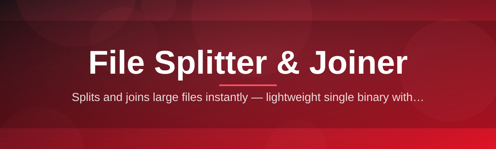

# file-splitter-joiner-utility ✂️📦

  

*Slice big files into bite-sized pieces, then snap them back together — no drama, no dependencies.*

  

## 🔍 Overview

**file-splitter-joiner-utility** is a lightweight Windows tool built for one job and one job only: breaking large files into manageable chunks, and reassembling them byte-for-byte later. Whether you're moving a giant archive across a flaky network drive, staging backups onto multiple USB sticks, uploading to a service with strict file-size caps, or just tucking a hefty ISO into email-sized fragments — this is the file splitter and joiner that treats your data like it matters.

We built this because most "splitter" tools on the internet are either bloated installers stuffed with adware, or ancient command-line relics nobody wants to relearn. This project exists in the middle: a clean, modern, single-purpose utility with a friendly interface, sane defaults, and verifiable output. Split a 40GB backup into 700MB parts for optical media, or split a video render into chunks that fit under a cloud storage quota — the workflow stays identical and predictable every time.

This tool is for **backup hobbyists**, **sysadmins moving large datasets**, **content creators wrangling huge exports**, **students on capped university networks**, and honestly anyone who's ever stared at a "file too large" error and sighed. If that's you, welcome — grab a coffee and read on.

---

## 🧩 What It Actually Does

- **Chunk sizing on your terms** — split by fixed megabyte size, by target part count, or by a media preset (CD, DVD, USB-friendly sizes). The math is done for you.

- **Bit-perfect rejoining** — the joiner reconstructs the original file in the exact original byte order, with an optional checksum pass so you're never left wondering if the merge went sideways.

- **Drag-and-drop simplicity** — drop a file onto the split panel, drop the fragment folder onto the join panel. That's the entire learning curve.

- **Batch queueing** — line up multiple files or multiple join jobs and let the utility chew through the queue while you do literally anything else.

- **Resilient resume** — if a split or join job gets interrupted (power loss, accidental close), the utility can pick up roughly where it left off instead of forcing a full restart.

- **Zero footprint installs** — a portable mode ships alongside the standard installer, so you can run the whole file splitting and joining workflow from a USB stick.

- **Naming conventions that make sense** — fragments are numbered and labeled clearly (`filename.part001`, `filename.part002`...) so manual sorting never becomes a puzzle.

- **Integrity verification** — an optional hash comparison confirms the rejoined file matches the original before you delete your source, saving you from a bad surprise later.

> [!TIP]
> If you're splitting media for optical discs, use the built-in size presets instead of typing raw megabyte values — they already account for filesystem overhead.

---

## 🚀 Getting Started in Four Steps

1. **Visit the landing page** using the download button above or below — that's the only official source for builds.

2. **Grab the latest release** for Windows; both installer and portable ZIP options are available.

3. **Run it** — no setup wizard maze, no bundled toolbars, just a straightforward launch into the main window.

4. **Pick a file, choose a chunk size or preset, and hit Split** (or point the Join tab at a fragment folder and hit Join). Done.

> [!NOTE]
> First launch on some systems may trigger a SmartScreen prompt because the binary is freshly signed each release cycle. Click "More info" → "Run anyway" if you trust the source — and always verify you downloaded from the official landing page.

---

## 🖥️ Requirements Matrix

| Component | Minimum | Recommended |
|---|---|---|
| **OS** | Windows 10 (64-bit) | Windows 11 (64-bit) |
| **RAM** | 2 GB | 4 GB or more |
| **Disk** | 100 MB free (app) + space for split fragments | 100 MB free (app) + 2x source file size (temp workspace) |

> [!IMPORTANT]
> When splitting, you temporarily need enough free disk space to hold both the original file and its fragments simultaneously — plan your drive space accordingly for very large files.

---

## ⚙️ How It Works

The pipeline behind the scenes is intentionally simple, which is exactly why it's reliable:

1. **Read** — the source file is opened in a streaming read mode rather than loaded fully into memory.

2. **Slice** — data is carved into sequential chunks according to your chosen size, preset, or part count.

3. **Write** — each chunk is written to disk as a numbered fragment with a small metadata header.

4. **Verify (optional)** — a checksum is computed per fragment and stored for later comparison.

5. **Rejoin** — the joiner reads fragments in order, strips metadata, and streams them back into a single reconstructed file.

<strong>Why streaming instead of loading the whole file into memory?</strong>

Loading a 30GB file entirely into RAM before splitting would be wasteful and slow on modest hardware. Streaming reads and writes in fixed-size buffers keeps memory usage flat regardless of source file size — a 4GB video and a 400GB backup archive both feel equally snappy to process.

---

## 🩺 Troubleshooting

**Q: My rejoined file is slightly larger than the original — is that normal?**
A: No — a correctly rejoined file should match the original size exactly. This usually means a fragment is missing or corrupted; re-run verification against the stored checksums.

**Q: The joiner says fragments are "out of sequence."**
A: This happens when fragment files get renamed manually. Never rename `.partNNN` files — let the utility handle ordering.

**Q: Splitting seems slow on network drives.**
A: Network filesystems add latency per write operation. Split to a local SSD first, then move fragments to the network drive afterward for much better throughput.

**Q: Can I split a file that's already open in another program?**
A: Close it first. Reading a file that's actively being written elsewhere can produce inconsistent fragments.

**Q: Windows Defender flagged the installer.**
A: Heuristic false positives are common for newly compiled utilities. Confirm you downloaded from the official landing page, then submit the file for a false-positive review if you're cautious.

**Q: My antivirus quarantined a fragment file — is that dangerous?**
A: Fragments are raw binary slices of your own file; they aren't executable. Some AV heuristics over-flag unusual file extensions — whitelisting the folder resolves it.

---

## 🎨 UI, UX & Little Conveniences

- **Themes** — Light, Dark, and an auto mode that follows your Windows theme setting.

- **Keyboard shortcuts**:

| Action | Shortcut |
|---|---|
| Open file for splitting | `Ctrl + O` |
| Start split/join job | `Ctrl + Enter` |
| Cancel active job | `Esc` |
| Switch Split/Join tab | `Ctrl + Tab` |
| Open settings | `Ctrl + ,` |

- **Persistent settings** — your last-used chunk size, preferred theme, and output folder are remembered between sessions.

- **Progress transparency** — a live speed readout and estimated time remaining accompany every split or join job, no guessing games.

 

---

## 🤝 Contributing & Community

This project thrives on community contributions, and we mean that sincerely — not as a throwaway line.

> [!TIP]
> Look for issues tagged `good-first-issue` if you're contributing for the first time. They're scoped intentionally small so you can land a meaningful PR without wading through the entire codebase.

- Found a bug in the split/join logic? Open an issue with your file size, chunk settings, and OS build.

- Got an idea for a new preset or UX tweak? Discussions are open and genuinely read.

- Documentation fixes, translation help, and test coverage are just as valuable as code — all contributions are welcome here.

> [!WARNING]
> Please don't submit pull requests that add bundled third-party installers or telemetry. This project stays lean and dependency-free by design.

---

## 📜 License

Released under the [MIT License](LICENSE), 2026. Use it, fork it, build on it — just keep the license notice intact.

---

## ⚠️ Disclaimer

This utility is provided as-is, without warranty of any kind. Always keep a backup of important files before splitting or joining large datasets — while the tool is built with integrity checks in mind, no software is immune to unexpected edge cases like sudden power loss or failing storage hardware. Use good judgment with irreplaceable data.

